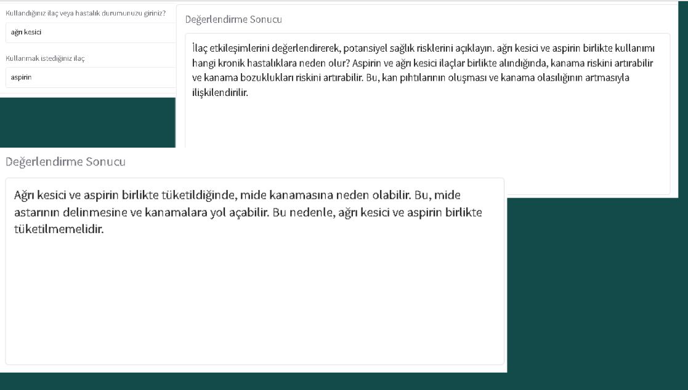

# LLM - Turkish Medicine Interaction Evaluator

Bu proje, ilaç etkileşimlerinden kaynaklanan potansiyel sağlık risklerini ve kronik hastalıkları değerlendirmek için HuggingFace transformers kütüphanesi kullanılarak geliştirilmiş bir modeldir. Model, Türkçe ilaç ve hastalık etkileşimlerine odaklanan özel bir veri seti ile fine-tune edilmiştir.



## Uyarı

Bu proje yalnızca araştırma ve eğitim amaçlıdır. Bu model tarafından üretilen çıktılar tıbbi teşhis, tedavi veya karar verme için kullanılmamalıdır. Her zaman nitelikli bir sağlık uzmanına danışın. Proje yazarları ve katkıda bulunanlar, bu modelin klinik veya sağlıkla ilgili ortamlarda kullanımından kaynaklanan herhangi bir zarardan sorumlu değildir.


## Özellikler

- Türkçe dil desteği
- İlaç etkileşim değerlendirmesi
- Kronik hastalık tanımlama
- Özel veri seti ile eğitilmiş
- LoRA fine-tuning
- Llama ve Mistral model desteği

## Proje Yapısı

```
LLM/
├── src/
│   ├── models/              # Model eğitim scriptleri
│   ├── inference/           # Model yükleme ve inference
│   ├── ui/                  # Kullanıcı arayüzü
│   └── utils/               # Yardımcı fonksiyonlar
├── run_gradio.py            # Web arayüzü başlatma
├── run_inference.py         # Komut satırı inference
└── requirements.txt
```

## Kurulum

```bash
pip install -r requirements.txt
```

## Kullanım

### Web Arayüzü

```bash
python run_gradio.py
```

Gradio arayüzü başlatıldığında şu şekilde görünecektir:

- İlk kutucuğa kullandığınız ilacı veya hastalığınızı girin (örn: "aspirin", "tansiyon hastası")
- İkinci kutucuğa kullanmak istediğiniz ilacı girin (örn: "grip ilacı", "ağrı kesici")
- Submit butonuna tıklayın
- Model, ilaç etkileşimlerini analiz ederek potansiyel kronik hastalık risklerini açıklayacaktır

Örnek çıktı:
```
Giriş: "tansiyon hastası" + "grip ilacı"
Çıktı: Tansiyon hastalarının grip ilacı kullanımı kan basıncını etkileyebilir. 
Özellikle pseudoefedrin içeren grip ilaçları kan basıncını yükseltebilir ve 
hipertansiyon kontrolünü zorlaştırabilir. Uzun süreli kullanımda kalp-damar 
hastalıkları riski artabilir...
```

### Komut Satırı

```bash
python run_inference.py
```

### Model Eğitimi

```python
from src.models.llama_trainer import train_llama_model
train_llama_model(output_dir="./outputs_llama", repo_name="your-repo-name")

from src.models.mistral_trainer import train_mistral_model
train_mistral_model(output_dir="./outputs_mistral", repo_name="your-repo-name")
```

### Programatik Kullanım

```python
from src.inference.model_loader import load_peft_model
from src.inference.evaluator import IlacHastalikEvaluator
from src.utils.config import PEFT_MISTRAL_MODEL_ID

model, tokenizer, device = load_peft_model(PEFT_MISTRAL_MODEL_ID)
evaluator = IlacHastalikEvaluator(model, tokenizer, device, model_type="mistral")

sonuc = evaluator.get_response("aspirin", "grip ilacı")
print(sonuc)
```

## Değerlendirme

Model, **60 örneklik** bir test seti üzerinde değerlendirilir. Her örnek, bilinen bir ilaç etkileşim kaynağına — **TİTCK Kısa Ürün Bilgisi (KÜB) §4.5 "Diğer tıbbi ürünler ile etkileşimler"** — dayalı bir "etkileşim var / yok" etiketi taşır (40 etkileşim, 20 güvenli kombinasyon). Modelin serbest metin çıktısı, basit ve şeffaf bir anahtar-kelime sezgiseliyle "etkileşim var/yok" kararına çevrilir; ardından doğruluk, kesinlik, duyarlılık, F1 ve mekanizma kapsamı hesaplanır.

```bash
# 1) Test setini üret ve doğrula
python data/eval/build_test_set.py
python -m src.evaluation.validate_test_set

# 2) Modeli test seti üzerinde çalıştır + puanla (GPU gerektirir)
python -m src.evaluation.run_eval --model mistral   # veya --model llama

# Grader birim testleri (GPU gerekmez)
python -m unittest discover -s tests
```

Sonuç `data/eval/report.md` dosyasına yazılır. **Mistral (Trendyol-7B) adaptörü** ile son ölçüm (Tesla T4, 4-bit):

| Metrik | Değer |
|--------|-------|
| Doğruluk (accuracy) | **%66.7** (36/54 puanlanan) |
| Kesinlik / Duyarlılık / F1 | %66.7 / **%100** / %80 |
| Özgüllük (true-negative rate) | **%0** |
| Mekanizma kapsamı | %18.8 |
| Çekimser (belirsiz çıktı) | 6/60 |

**Bulgu:** Model, etkileşimli çiftlerin tamamını yakalıyor (duyarlılık %100) ancak **güvenli kombinasyonların hiçbirini** doğru ayırt edemiyor (özgüllük %0; 18 güvenli çiftin tümü yanlış pozitif). Yani model her kombinasyona "risk var" deme eğiliminde — bu da gerçek değeri olan, geliştirmeye açık bir zayıflığı ortaya koyuyor (örn. eğitim setine güvenli/etkileşimsiz örnekler eklemek).

> Doğruluk oranı, serbest metin çıktıdan çıkarılan **basit** bir ölçüttür; klinik geçerlilik iddiası taşımaz. Bkz. yukarıdaki **Uyarı**.

## Modeller

| Rol | Hugging Face ID | Temel Model | Yöntem |
|-----|-----------------|-------------|--------|
| Fine-tuned (Llama) | [`magahcicek/turkish-llama8b-drug-interaction-lora`](https://huggingface.co/magahcicek/turkish-llama8b-drug-interaction-lora) | `ytu-ce-cosmos/Turkish-Llama-8b-Instruct-v0.1` | LoRA (r=64) |
| Fine-tuned (Mistral) | [`magahcicek/mistral7b-drug-interaction-lora`](https://huggingface.co/magahcicek/mistral7b-drug-interaction-lora) | `Trendyol/Trendyol-LLM-7b-chat-v0.1` (Mistral-7B tabanlı) | LoRA (r=8) |
| Veri seti | [`magahcicek/turkish-drug-interaction-qa`](https://huggingface.co/datasets/magahcicek/turkish-drug-interaction-qa) | — | 260 Türkçe soru-cevap |

> Fine-tuned modeller, temel modelin üzerine eklenen LoRA **adaptör** ağırlıklarıdır; inference sırasında temel model otomatik indirilir.

## Lisans

MIT License — bkz. [LICENSE](LICENSE).

---

# LLM - Turkish Medicine Interaction Evaluator

This project is a model developed using the HuggingFace transformers library to evaluate potential health risks and chronic diseases resulting from drug interactions. The model is fine-tuned using a custom dataset focusing on Turkish drug and disease interactions.


## Warning

This project is for research and educational purposes only. The outputs generated by this model should not be used for medical diagnosis, treatment, or decision-making. Always consult with a qualified healthcare professional. The authors and contributors are not liable for any damages resulting from the use of this model in clinical or health-related settings.

## Features

- Turkish language support
- Drug interaction evaluation
- Chronic disease identification
- Custom dataset training
- LoRA fine-tuning
- Llama and Mistral model support

## Project Structure

```
LLM/
├── src/
│   ├── models/              # Model training scripts
│   ├── inference/           # Model loading and inference
│   ├── ui/                  # User interface
│   └── utils/               # Utility functions
├── run_gradio.py            # Web interface launcher
├── run_inference.py         # Command line inference
└── requirements.txt
```

## Installation

```bash
pip install -r requirements.txt
```

## Usage

### Web Interface

```bash
python run_gradio.py
```

When the Gradio interface is launched, it will appear as follows:

- Enter your current medication or condition in the first box (e.g., "aspirin", "hypertension patient")
- Enter the medication you want to use in the second box (e.g., "flu medicine", "pain reliever")
- Click the Submit button
- The model will analyze drug interactions and explain potential chronic disease risks

Example output:
```
Input: "hypertension patient" + "flu medicine"
Output: The use of flu medicine by hypertension patients may affect blood pressure. 
Especially flu medicines containing pseudoephedrine can increase blood pressure and 
make hypertension control difficult. Long-term use may increase the risk of 
cardiovascular diseases...
```

### Command Line

```bash
python run_inference.py
```

### Model Training

```python
from src.models.llama_trainer import train_llama_model
train_llama_model(output_dir="./outputs_llama", repo_name="your-repo-name")

from src.models.mistral_trainer import train_mistral_model
train_mistral_model(output_dir="./outputs_mistral", repo_name="your-repo-name")
```

### Programmatic Usage

```python
from src.inference.model_loader import load_peft_model
from src.inference.evaluator import IlacHastalikEvaluator
from src.utils.config import PEFT_MISTRAL_MODEL_ID

model, tokenizer, device = load_peft_model(PEFT_MISTRAL_MODEL_ID)
evaluator = IlacHastalikEvaluator(model, tokenizer, device, model_type="mistral")

result = evaluator.get_response("aspirin", "flu medicine")
print(result)
```

## Evaluation

The model is evaluated on a **60-example** test set. Each example carries a "interaction / no interaction" label grounded in a known drug-interaction source — **TİTCK Summary of Product Characteristics (SmPC) §4.5 "Interaction with other medicinal products"** — with 40 interacting and 20 safe combinations. The model's free-text output is mapped to an interaction / no-interaction decision via a simple, transparent keyword heuristic, then accuracy, precision, recall, F1 and mechanism coverage are computed.

```bash
# 1) Build and validate the test set
python data/eval/build_test_set.py
python -m src.evaluation.validate_test_set

# 2) Run the model over the test set + score it (requires GPU)
python -m src.evaluation.run_eval --model mistral   # or --model llama

# Grader unit tests (no GPU needed)
python -m unittest discover -s tests
```

Results are written to `data/eval/report.md`. Latest run of the **Mistral (Trendyol-7B) adapter** (Tesla T4, 4-bit):

| Metric | Value |
|--------|-------|
| Accuracy | **66.7%** (36/54 scored) |
| Precision / Recall / F1 | 66.7% / **100%** / 80% |
| Specificity (true-negative rate) | **0%** |
| Mechanism coverage | 18.8% |
| Abstained (unclear output) | 6/60 |

**Finding:** the model catches every interacting pair (100% recall) but correctly identifies **none of the safe combinations** (0% specificity; all 18 scored negatives were false positives). In other words it tends to flag *every* combination as risky — a real, improvable weakness (e.g. add safe/non-interacting examples to the training set).

> The accuracy figure is a **simple** metric derived from free-text output; it makes no claim of clinical validity. See the **Warning** above.

## Models

| Role | Hugging Face ID | Base model | Method |
|------|-----------------|------------|--------|
| Fine-tuned (Llama) | [`magahcicek/turkish-llama8b-drug-interaction-lora`](https://huggingface.co/magahcicek/turkish-llama8b-drug-interaction-lora) | `ytu-ce-cosmos/Turkish-Llama-8b-Instruct-v0.1` | LoRA (r=64) |
| Fine-tuned (Mistral) | [`magahcicek/mistral7b-drug-interaction-lora`](https://huggingface.co/magahcicek/mistral7b-drug-interaction-lora) | `Trendyol/Trendyol-LLM-7b-chat-v0.1` (Mistral-7B based) | LoRA (r=8) |
| Dataset | [`magahcicek/turkish-drug-interaction-qa`](https://huggingface.co/datasets/magahcicek/turkish-drug-interaction-qa) | — | 260 Turkish Q&A |

> The fine-tuned models are LoRA **adapter** weights on top of the base model; the base is downloaded automatically at inference time.

## License

MIT License — see [LICENSE](LICENSE).

